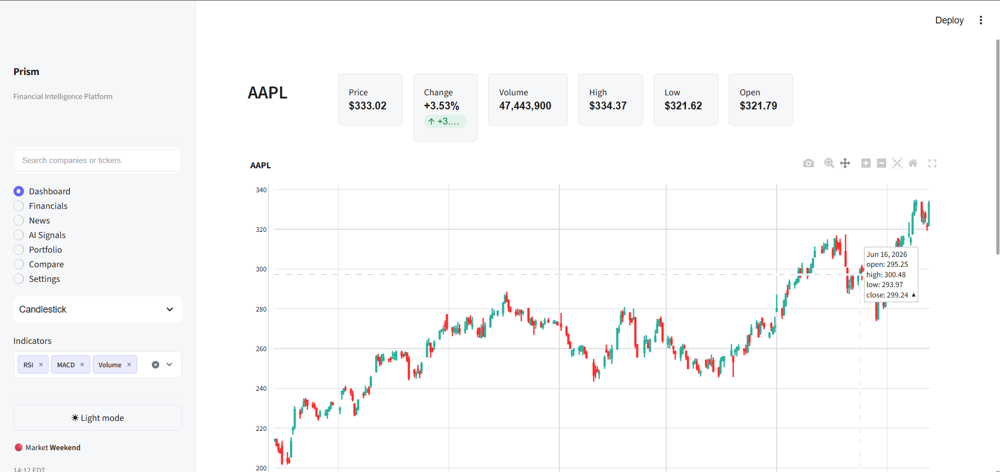
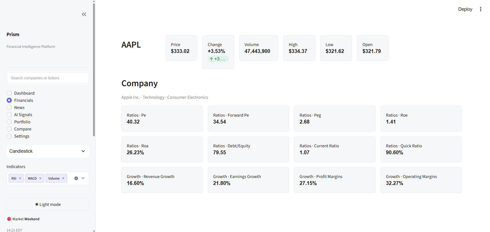
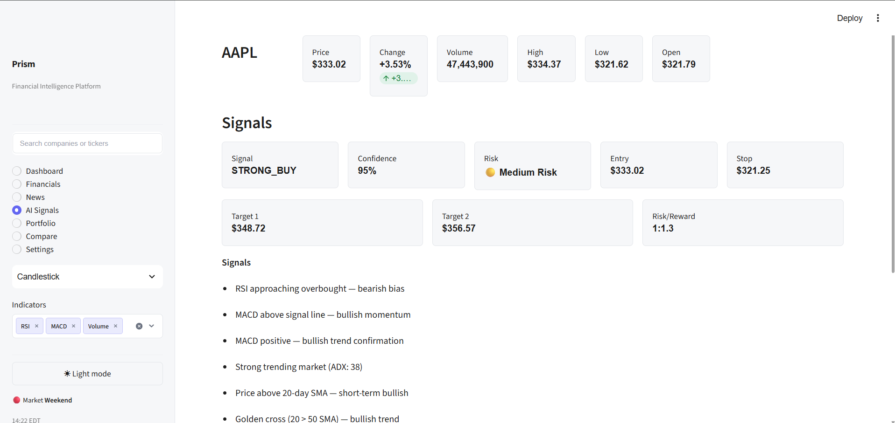
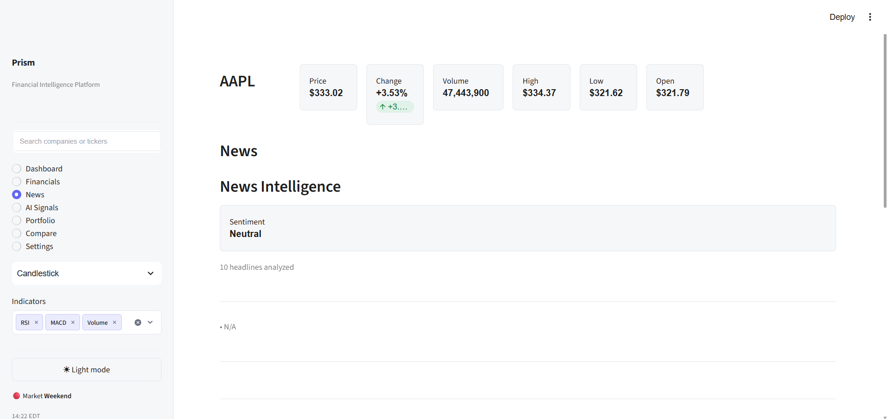
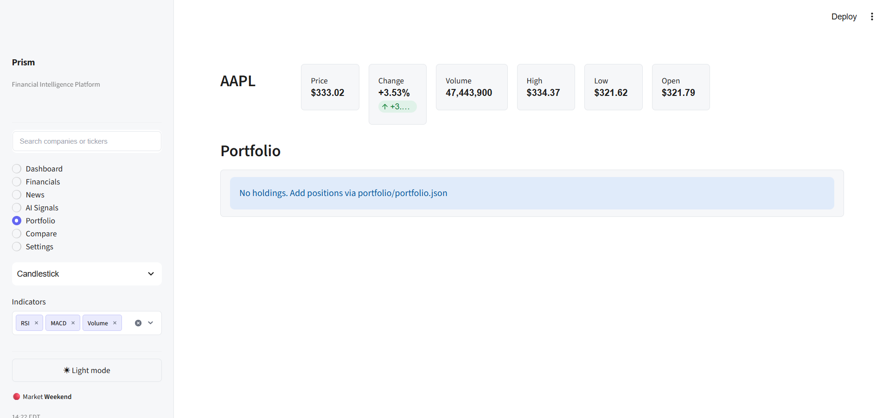

# Prism — Financial Intelligence Platform

> **Decode markets. Discover conviction.**
>
> *Where data meets decisive investing.*

---

Prism is a modern Python-powered financial intelligence platform that transforms raw market data into actionable insights. Combining real-time stock analysis, interactive charting, technical indicators, AI-assisted trading signals, news aggregation, portfolio tracking, and comprehensive financial visualizations, Prism delivers a professional-grade dashboard experience. Built with Streamlit, Plotly, and yfinance, the platform is designed for investors, analysts, and developers who demand clarity and performance from their financial tools.

---

## Internship Information

| Field | Value |
|-------|-------|
| Full Name | Kislay Dutta |
| Intern ID | CITS4762 |
| Number of Weeks | 6 Weeks |
| Project Name | Prism — Financial Intelligence Platform |
| Project Scope | Prism provides a comprehensive financial intelligence solution that integrates real-time stock market analysis with interactive candlestick, OHLC, line, and area charts. The platform includes a full suite of technical indicators such as RSI, MACD, Moving Averages, Bollinger Bands, ADX, ATR, Stochastic, SuperTrend, VWAP, and Fibonacci levels. AI-generated trading insights offer market observations, trend interpretation, and decision support with confidence scoring. The application aggregates financial statements, company fundamentals, balance sheets, income statements, and cash flow data. Additional capabilities include market news aggregation with sentiment analysis, watchlists and favorites for tracking, portfolio monitoring with P&L calculations, and multi-company comparison. Prism supports Light, Dark, and AMOLED themes, is built on a modern Streamlit architecture with responsive dashboard design, and follows a production-ready modular codebase structure. |

---

## Project Overview

Prism is a financial intelligence platform built with Python, Streamlit, Plotly, and yfinance. The application follows a modular architecture with clean separation between data, logic, and presentation layers. A centralized theme system provides consistent styling across Light, Dark, and AMOLED modes, ensuring a cohesive visual experience throughout every component. Real-time market visualization, interactive controls, and professional charting make Prism a complete solution for stock analysis and portfolio management.

---

## Core Features

### Market Intelligence

- Live stock data from Yahoo Finance with retry logic and caching
- Interactive candlestick, OHLC, line, and area charts
- Full technical indicator suite with pipeline orchestration
- Historical price trends with normalized comparison

### AI Insights

- Multi-factor scoring engine with confidence levels
- Trading signals with entry, stop-loss, and target prices
- Trend interpretation and market observations
- Risk classification and decision support

### Financial Analysis

- Company fundamentals with financial ratios
- Balance sheet, income statement, and cash flow analysis
- Growth metrics, valuation analysis, and dividend data
- Fundamental scoring and health assessment

### Portfolio

- Watchlist and favorites with quick-access tracking
- Portfolio monitoring with position tracking and P&L
- Allocation analytics and risk exposure
- Multi-company comparison with normalized charts

### User Experience

- Light Theme with warm, paper-like tones
- Dark Theme with charcoal surfaces and muted accents
- AMOLED Theme with true black backgrounds
- Responsive dashboard layout
- Modern sidebar with search and navigation
- Fast ticker search with fuzzy matching
- Interactive controls with smooth transitions

---

## Tech Stack

| Technology | Purpose |
|------------|---------|
| Python | Core language |
| Streamlit | Web framework and UI |
| Plotly | Interactive charting |
| Pandas | Data manipulation |
| NumPy | Numerical computation |
| yfinance | Market data retrieval |
| Requests | HTTP requests |
| BeautifulSoup | HTML parsing |

---

## Project Structure

```
Prism/
├── app.py                  # Application entry point
├── core/                   # Foundation layer
├── ui/                     # UI components and theming
├── charts/                 # Charting engine
├── financials/             # Financial analysis
├── indicators/             # Technical indicators
├── data/                   # Data layer
├── news/                   # News aggregation
├── portfolio/              # Portfolio management
├── ai/                     # AI signal engine
├── reports/                # Report generation
├── export/                 # Export engine
├── tests/                  # Test suite
├── Legacy/                 # Historical versions
├── requirements.txt        # Dependencies
└── README.md               # Documentation
```

---

## Installation

### Prerequisites

- Python 3.10 or higher
- pip package manager

### Setup

```bash
# Clone the repository
git clone https://github.com/yourusername/prism.git
cd prism

# Install dependencies
pip install -r requirements.txt

# Run the application
streamlit run app.py
```

### Quick Start

1. Open the application in your browser at `http://localhost:8501`
2. Enter a stock ticker in the sidebar search field
3. Select a chart type from the dropdown
4. Navigate between views using the sidebar navigation
5. Toggle between Light, Dark, and AMOLED themes

---

## Screenshots

### Dashboard



### Financial Analysis



### AI Insights



### News Insights



### Portfolio



---

## Roadmap

- [x] Live stock dashboard with interactive charts
- [x] Theme engine with Light, Dark, and AMOLED support
- [x] Portfolio management with P&L tracking
- [x] Financial statements and company fundamentals
- [x] News aggregation with sentiment analysis
- [x] AI-powered trading signals and insights
- [x] Export engine for CSV, Excel, PDF, and images
- [ ] AI-powered forecasting models
- [ ] Alert system for price and indicator thresholds
- [ ] Multi-language support
- [ ] Cloud deployment and hosting

---

## License

This project is licensed under the MIT License. See [LICENSE](LICENSE) for details.

---

## Contributing

Contributions are welcome. Please open an issue or pull request for any improvements.

1. Fork the repository
2. Create a feature branch (`git checkout -b feature/amazing-feature`)
3. Commit your changes (`git commit -m 'feat: add amazing feature'`)
4. Push to the branch (`git push origin feature/amazing-feature`)
5. Open a Pull Request
